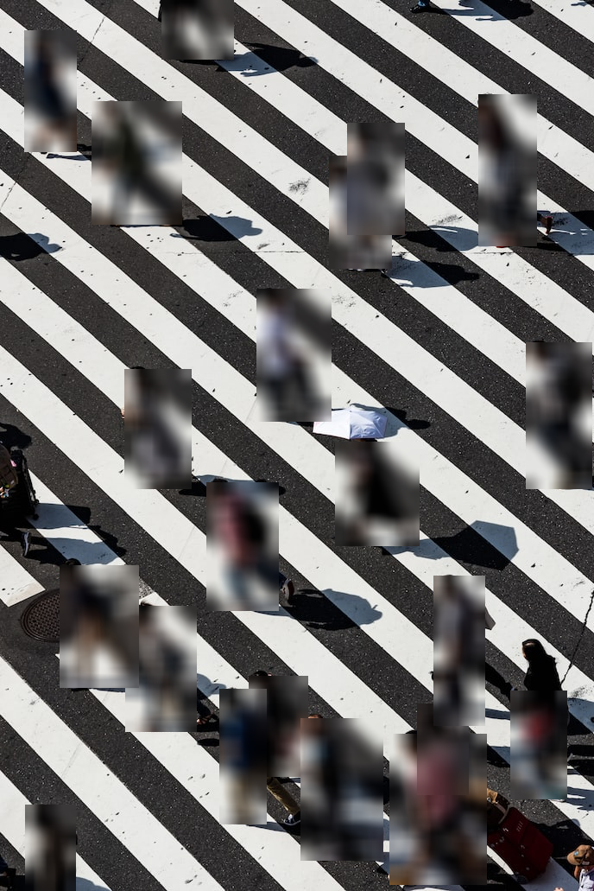

# privapy

> Anonymize your data

[](https://pypi.python.org/pypi/privapy/)
[](https://pypi.python.org/pypi/privapy/)
[](https://github.com/vincentmin/privapy/actions/workflows/test.yaml)
[](https://privapy.readthedocs.io/en/latest/?badge=latest)
[](https://coveralls.io/github/vincentmin/privapy?branch=main)
[](https://github.com/christophevg/pypi-template)

## Documentation

Visit [Read the Docs](https://privapy.readthedocs.org) for the full documentation, including overviews and several examples.

## Installation

```bash
pip install privapy
```

## Disclaimer

This package provides no guarantee of anonymity. It is the user's responsibility to ensure that the data is properly anonymized. The authors of this package are not responsible for any results or misuse of this package.

## Usage

### text

```python
from privapy.text import TextCleaner

text = "I live in New York and work at Google. My email is john@google.com"
cleaner = TextCleaner(steps="all")
cleaned_text = cleaner.clean(text)
# 'I live in <<ENT>> and work at <<ENT>. My email is <<EMAIL>>'
```

### image

```python
from privapy.image import ImageCleaner
from PIL import Image

cleaner = ImageCleaner()
img = Image.open("image.jpg")
cleaned_image = cleaner.clean(img)
```

input image (`img`):

output image (`cleaned_image`):


## Coming in future releases

- text
  - Add more cleaning methods
  - Add Spacy integration
- image
  - Add more cleaning methods
    - blackout
    - pixelate
  - Add more detection methods
    - face detection
    - dlib
    - mediapipe
